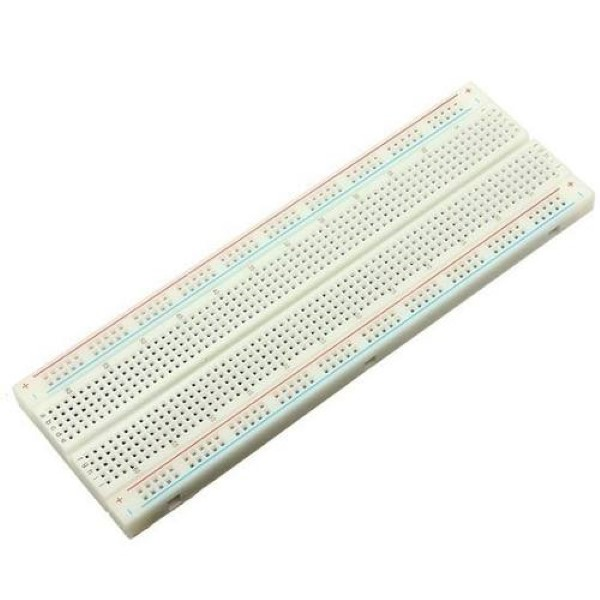

# Projeto Final de Fundamentos de Sistemas CiberFisicos

Hear2u é um projeto que tem por objetivo ser usado como ferramenta de auxilio contra problemas de barulho.
Ele irá funcionar com um **sensor de audio** que irá captar e medir o nivel de decibéis que está sendo emitido por alguma fonte e irá repassar essa informação para o **Raspberry Pi 3** que por fim, irá acionar um **buzzer** e mostrar, em uma **tela LCD**, aonde está vindo o barulho.

## Itens utilizados:

### 1. Raspberry Pi 3

### 2. Protoboard
